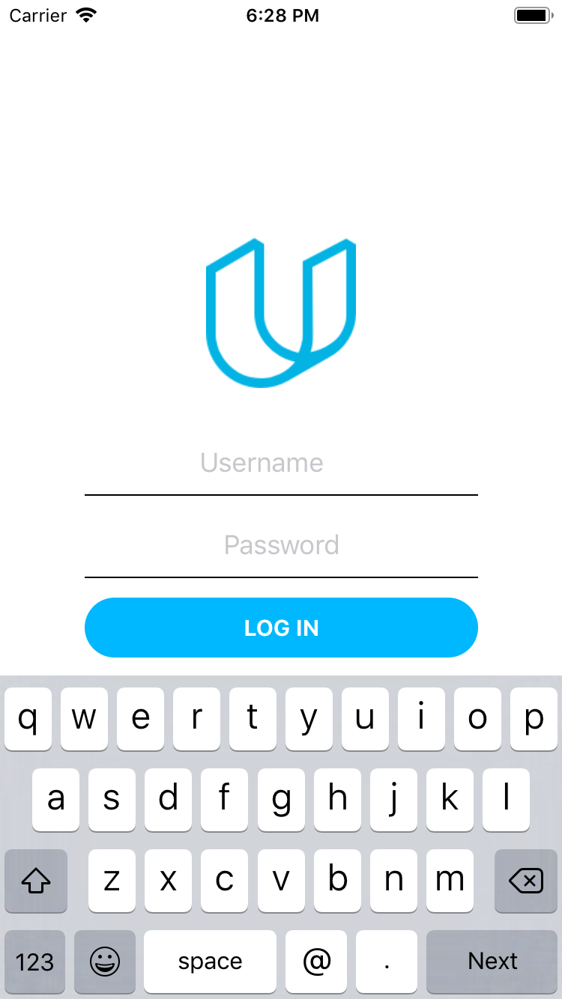

# on-the-map

This is the project solution to the first assignment of the iOS developer nanodegree from Udacity. The main challenge was to build an app using the URL Loading system to retrieve the location of the students. There's a base class for handling the creation and usage of the data tasks. The client classes of each used API were built on top of this one.

## Images of the app

